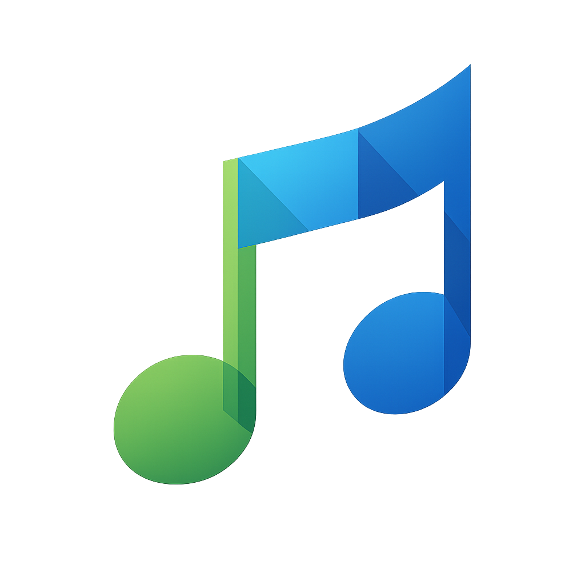
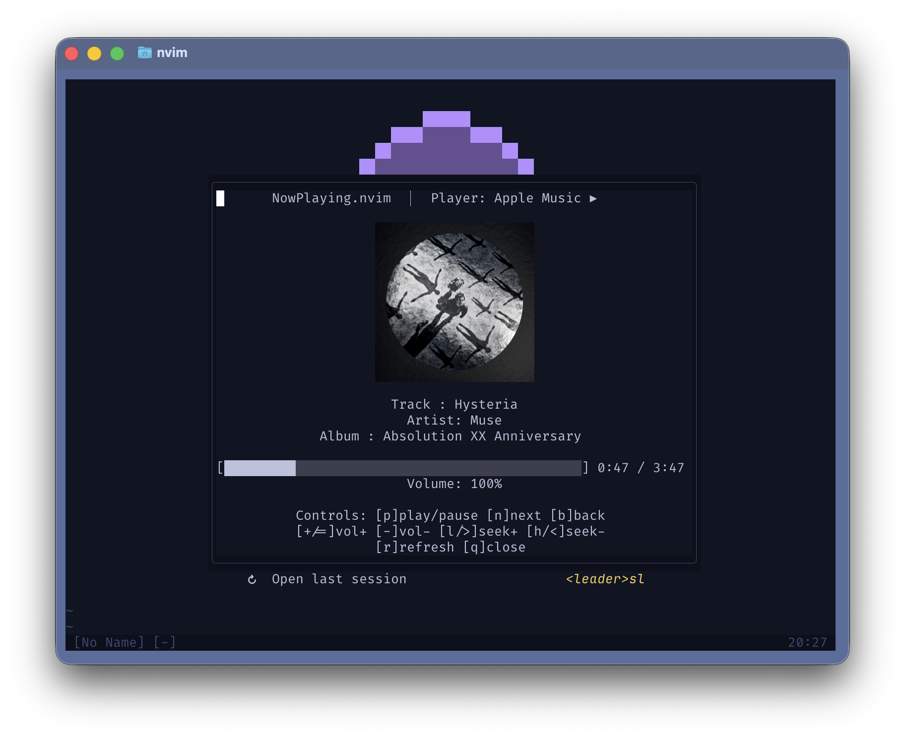
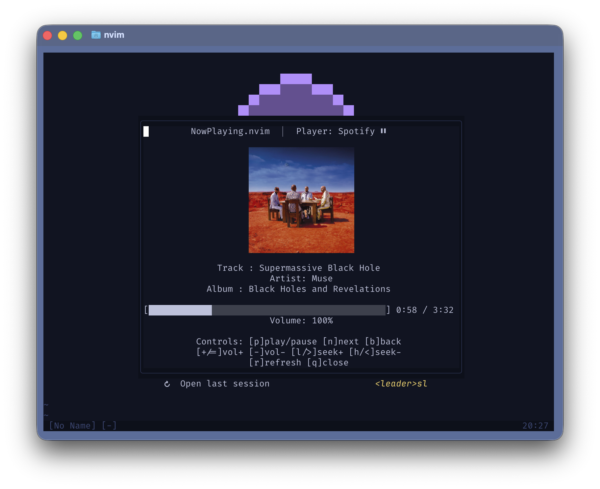
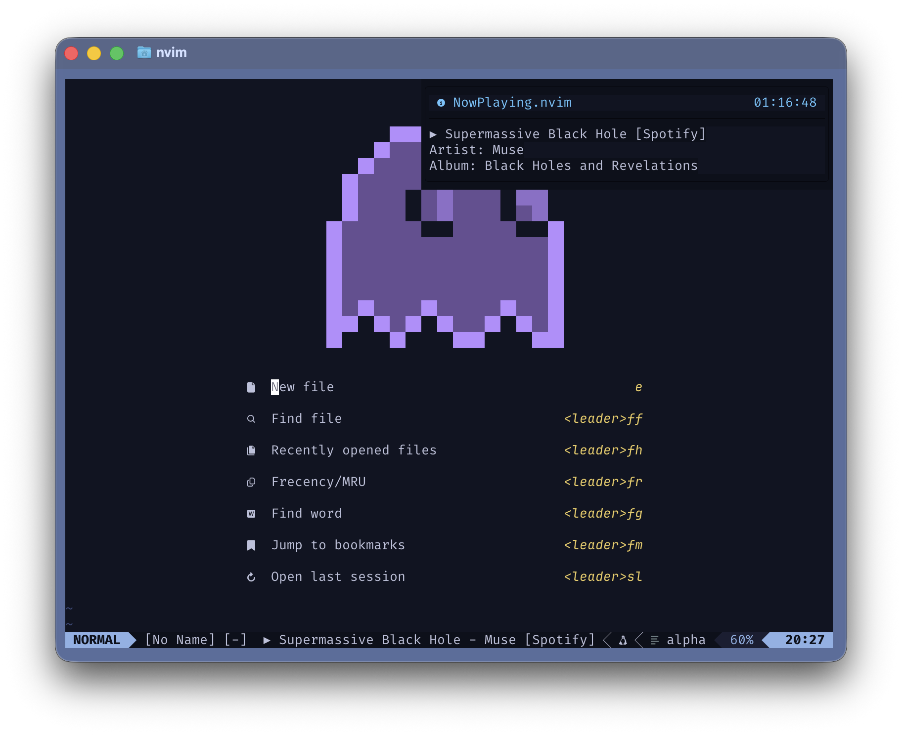
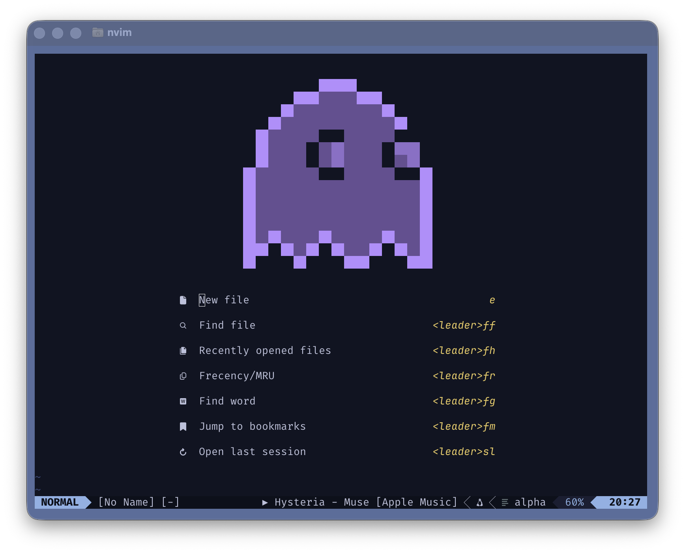
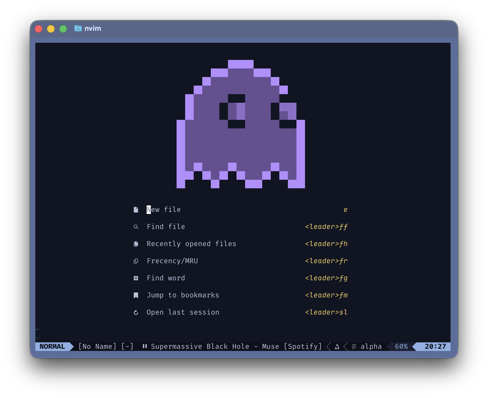

<div align="center">

  
  <h2>NowPlaying.nvim 🎶</h2>
  <p>
    <a href="https://github.com/Ferouk/nowplaying.nvim/stargazers">
      
    </a>
    <a href="https://github.com/Ferouk/nowplaying.nvim/issues">
      
    </a>
    <a href="https://github.com/Ferouk/nowplaying.nvim/graphs/contributors">
      
    </a>
  </p>
  <p>Lightweight Neovim plugin that shows what's playing in Apple Music or Spotify on macOS, with controls, notifications, floating panel, and artwork rendering.</p>
  
</div>

## Features ✨

- AppleScript-powered Apple Music and Spotify support.
- Panel with artwork, metadata, progress bar, and key hints.
- Commands for play/pause, next/previous, volume, seek, and refresh.
- Optional track-change notifications (`vim.notify`).
- Statusline helper (`require("player").statusline()`).
- Real artwork rendering via [image.nvim](https://github.com/3rd/image.nvim).

## Preview 📸

<details>
  <summary>Panel (playing)</summary>
  
  <p>Floating panel with artwork, metadata, progress, and controls while a track is playing.</p>
</details>

<details>
  <summary>Panel (paused)</summary>
  
  <p>Panel showing paused state.</p>
</details>

<details>
  <summary>Notification</summary>
  
  <p>Track-change toast via <code>vim.notify</code>.</p>
</details>

<details>
  <summary>Statusline (playing)</summary>
  
  <p>Statusline snippet showing playing icon/text.</p>
</details>

<details>
  <summary>Statusline (paused)</summary>
  
  <p>Statusline snippet showing paused icon/text.</p>
</details>

## Requirements 📦

- macOS with Apple Music or Spotify installed.
- `osascript` available (default on macOS).
- `curl` for downloading Spotify artwork to cache (optional; only required if artwork is enabled).
- [ImageMagick](https://imagemagick.org/) (optional; only required if artwork is enabled).
- [image.nvim](https://github.com/3rd/image.nvim) (optional; only required if artwork is enabled).

## Installation 🧰

### Lazy.nvim

Without image.nvim dependency:

```lua
{
  "Ferouk/nowplaying.nvim",
  config = function()
    require("player").setup()
  end,
}
```

With image.nvim dependency (if artwork is enabled):

```lua
{
  "Ferouk/nowplaying.nvim",
  dependencies = {
    {
      "3rd/image.nvim",
      opts = { backend = "kitty" }, -- or "ueberzug" / "sixel" check your terminal compatibility
    },
  },
  config = function()
    require("player").setup()
  end,
}
```

Packer.nvim:

Without image.nvim dependency:

```lua
use({
  "Ferouk/nowplaying.nvim",
  config = function()
    require("player").setup()
  end,
})
```

With image.nvim dependency (if artwork is enabled):

```lua
use({
  "Ferouk/nowplaying.nvim",
  requires = {
    {
      "3rd/image.nvim",
      config = function()
        require("image").setup({ backend = "kitty" }) -- or "ueberzug" / "sixel" check your terminal compatibility
      end,
    },
  },
  config = function()
    require("player").setup()
  end,
})
```

## Commands ⌨️

- `:NowPlayingPlayPause` toggle playback
- `:NowPlayingNext` / `:NowPlayingPrev` next/previous track
- `:NowPlayingStop` stop playback
- `:NowPlayingVolUp` / `:NowPlayingVolDown` volume ±5%
- `:NowPlayingSeekForward` / `:NowPlayingSeekBackward` seek ±5s
- `:NowPlayingTogglePanel` open/close the panel
- `:NowPlayingNotify` show current track via `vim.notify`
- `:NowPlayingRefresh` refresh state and redraw UI

Panel keymaps: `p` play/pause, `n` next, `b` previous, `x` stop, `+`/`=` volume up, `-` volume down, `l`/`>` seek forward, `h`/`<` seek backward, `r` refresh, `q` close.

Global keymaps (optional): set `keymaps.enabled = true` to register `<leader>np` bindings:
- `<leader>np` toggle panel
- `<leader>npp` play/pause
- `<leader>npn` next track
- `<leader>npb` previous track
- `<leader>npx` stop
- `<leader>np+` / `<leader>np-` volume up/down
- `<leader>npl` / `<leader>nph` seek forward/backward
- `<leader>npr` refresh
- `<leader>npi` notify

## Configuration 🛠️

```lua
require("player").setup({
  player_priority = { "apple_music", "spotify" }, -- default order
  poll = {
    enabled = true,
    interval_ms = 5000,
  },
  notify = {
    enabled = false, -- default: off
    timeout = 2500,
    elements = {
      track_title = true,
      artist = true,
      album = true,
      status_icon = true,
      player = true,
    },
  },
  statusline = {
    elements = {
      track_title = true,
      artist = true,
      album = true,
      status_icon = true, -- ▶/⏸
      player = true,
    },
    separator = " - ",
    max_length = 50, -- truncate to display width
    marquee = {
      enabled = true, -- scroll overflow text only
      step_ms = 140, -- animation tick rate
      pause_ms = 1400, -- pause at each edge
      gap = "   ", -- spacing between looped text copies
    },
  },
  keymaps = {
    enabled = false, -- opt-in global mappings
    prefix = "<leader>np",
    maps = {
      toggle_panel = "", -- <leader>np
      play_pause = "p",
      next_track = "n",
      previous_track = "b",
      stop = "x",
      volume_up = "+",
      volume_down = "-",
      seek_forward = "l",
      seek_backward = "h",
      refresh = "r",
      notify = "i",
    },
  },
  panel = {
    enabled = true,
    border = "rounded",
    width = nil, -- set to number for fixed width; nil auto/fallback
    height = nil, -- set to number for fixed height; nil auto
    elements = {
      track_title = true,
      artist = true,
      album = true,
      progress_bar = true,
      volume = true,
      controls = true,
      artwork = {
        enabled = false,
        cache_dir = vim.fn.stdpath("cache") .. "/nowplaying.nvim",
        download = false, -- download Spotify artwork URLs to cache
        width = 20,
        height = 10,
      },
    },
  },
  auto_switch = true, -- fall back to next provider when inactive
  log_level = "warn",
})
```

Visibility: toggle any `true`/`false` field under `panel.elements`, `notify.elements`, or `statusline.elements`.
Default is all `true` except artwork in panel.

## Statusline / Winbar 📏

```lua
-- LuaLine/Heirline/etc.
local nowplaying = require("player").statusline
```

### Lualine

```lua
local nowplaying = require("player").statusline

require("lualine").setup({
  sections = {
    lualine_c = { nowplaying },
  },
})
```

### Heirline

```lua
local statusline = require("player").statusline

require("heirline").setup({
  statusline = {
    statusline,
    -- add other components here
  },
})
```

## Artwork 🖼️

Album artwork is rendered as real images in the panel using **image.nvim**. Spotify artwork can be downloaded and cached when `panel.elements.artwork.download = true`; Apple Music artwork is extracted to `cache_dir`.

## Planned Work 🔜

- Linux support (MPRIS backend)
- Windows support (media session/PowerShell backend)

## Credits 🙌

Artwork rendering powered by [image.nvim](https://github.com/3rd/image.nvim) by @3rd.

## License 📄

GPL-3.0-only. (See LICENSE)
