<div align="center">

  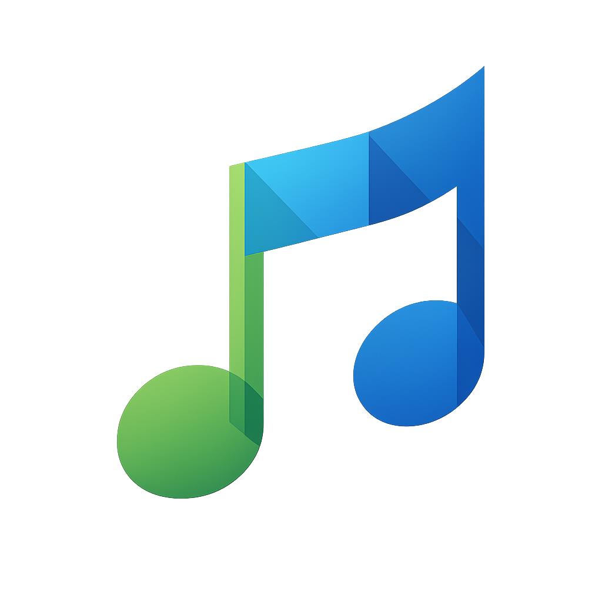
  <h2>NowPlaying.nvim 🎶</h2>
  <p>
    <a href="https://github.com/mattpetters/nowplaying.nvim/stargazers">
      
    </a>
    <a href="https://github.com/mattpetters/nowplaying.nvim/issues">
      
    </a>
    <a href="https://github.com/mattpetters/nowplaying.nvim/graphs/contributors">
      
    </a>
    
  </p>
  <p>Lightweight Neovim plugin that shows what's playing in Apple Music or Spotify on macOS — featuring a responsive floating panel, Telescope-powered Spotify search, adaptive accent colors, drag &amp; resize, and real album artwork rendering.</p>
  <p><em>Forked from <a href="https://github.com/Ferouk/nowplaying.nvim">Ferouk/nowplaying.nvim</a> with significant additions.</em></p>
  
</div>

---

## What's New in This Fork 🚀

This fork extends the original [Ferouk/nowplaying.nvim](https://github.com/Ferouk/nowplaying.nvim) with:

- **Spotify Web API integration** — full PKCE OAuth authentication, playback control, and search via the Spotify API.
- **Telescope search picker** — search Spotify for tracks, albums, artists, and playlists directly from Neovim with rich previews and album art.
- **Responsive panel layout** — the floating panel adapts to its size with four breakpoints (large → medium → small → tiny), progressively hiding elements as the panel shrinks.
- **Draggable & resizable panel** — left-click to drag, right-click or grab edges/corners to resize. Artwork follows the panel fluidly during drag.
- **Adaptive accent colors** — panel border and background tint are extracted from the current album artwork via ImageMagick.
- **Playlist & album context playback** — tracks from playlist/album drill-downs play with `context_uri` so Spotify continues through the list.
- **Marquee scrolling statusline** — long track info scrolls smoothly in the statusline instead of hard-truncating.
- **macOS Now Playing provider** — additional `macos_media` provider for system-level media detection. Requires the external `nowplaying-cli` binary (`brew install nowplaying-cli`).
- **340+ tests** — comprehensive test suite across 15 modules.

---

## Features ✨

- AppleScript-powered Apple Music and Spotify support; the optional `macos_media` provider requires `nowplaying-cli` (`brew install nowplaying-cli`).
- Spotify Web API with PKCE OAuth (search, playback, queue).
- Telescope picker for searching tracks, albums, artists, and playlists — with artwork previews.
- Responsive floating panel with artwork, metadata, progress bar, and controls.
- Draggable and resizable panel with mouse interaction.
- Adaptive accent colors extracted from album artwork (border + background tint).
- Playlist and album context playback (tracks continue through the list).
- Commands for play/pause, next/previous, stop, volume, seek, and refresh.
- Optional track-change notifications (`vim.notify`).
- Statusline helper with marquee scrolling (`require("player").statusline()`).
- Real artwork rendering via [image.nvim](https://github.com/3rd/image.nvim).

## Preview 📸

<details open>
  <summary><strong>Telescope Spotify Search</strong></summary>
  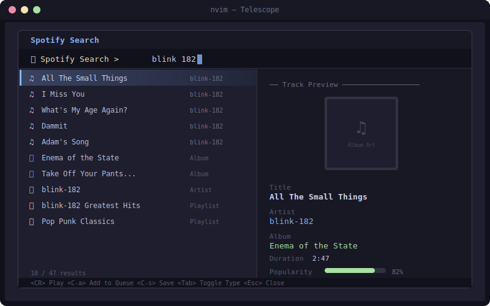
  <p>Search Spotify for tracks, albums, artists, and playlists with rich previews and album art. <code>:NowPlayingSearch</code> or <code>&lt;leader&gt;nps</code>.</p>
</details>

<details open>
  <summary><strong>Responsive Panel — Large</strong></summary>
  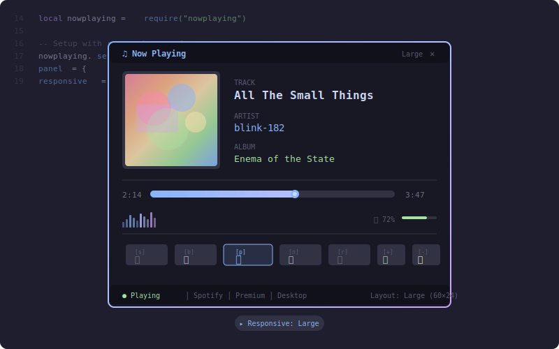
  <p>Full layout with artwork, metadata, progress bar, and controls with key hints.</p>
</details>

<details>
  <summary><strong>Responsive Panel — Small</strong></summary>
  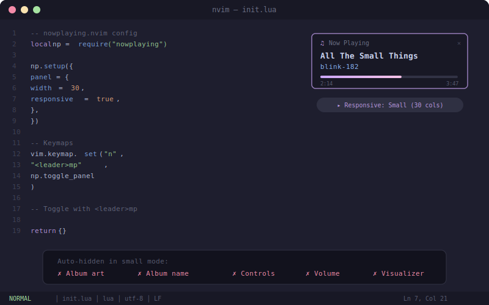
  <p>Compact mode: just title, artist, and progress bar. Artwork and controls auto-hide at smaller sizes.</p>
</details>

<details>
  <summary><strong>Adaptive Accent Colors</strong></summary>
  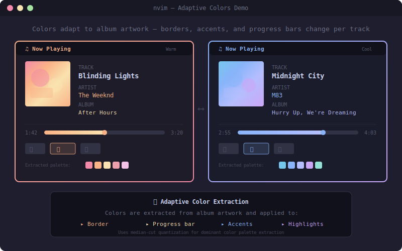
  <p>Border and background tint are extracted from the current album artwork — each album gets its own color scheme.</p>
</details>

<details>
  <summary><strong>Drag & Resize</strong></summary>
  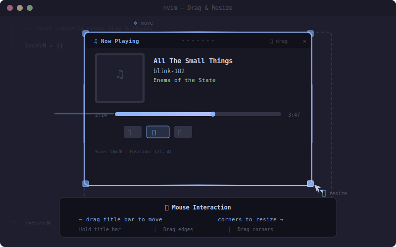
  <p>Left-click and drag to move the panel. Right-click or grab corners/edges to resize. Artwork follows the panel fluidly.</p>
</details>

<details>
  <summary>Panel (playing)</summary>
  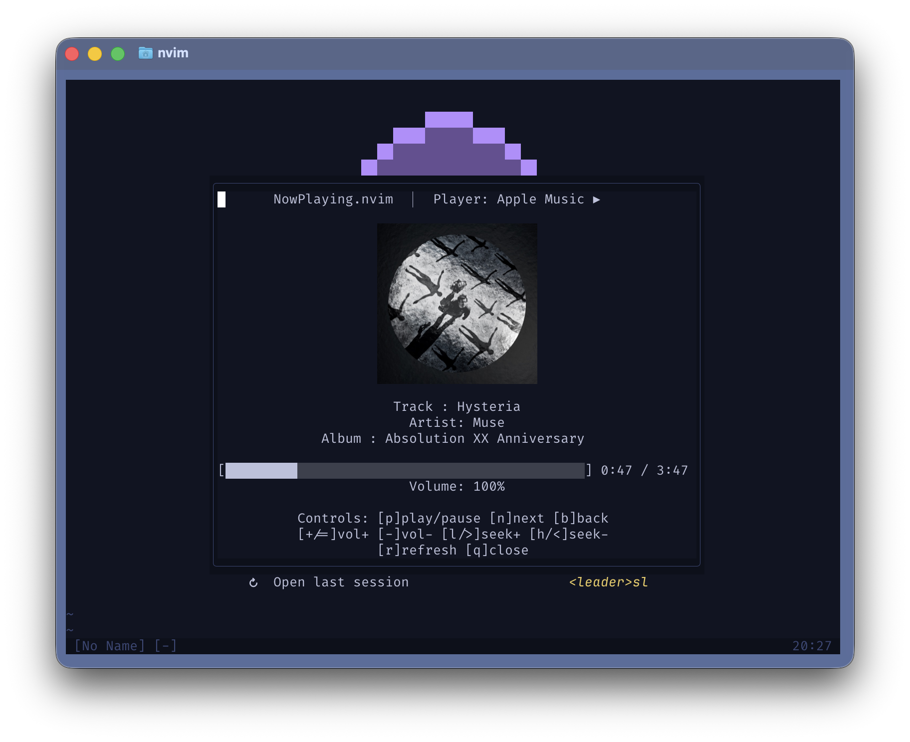
  <p>Floating panel with artwork, metadata, progress, and controls while a track is playing.</p>
</details>

<details>
  <summary>Panel (paused)</summary>
  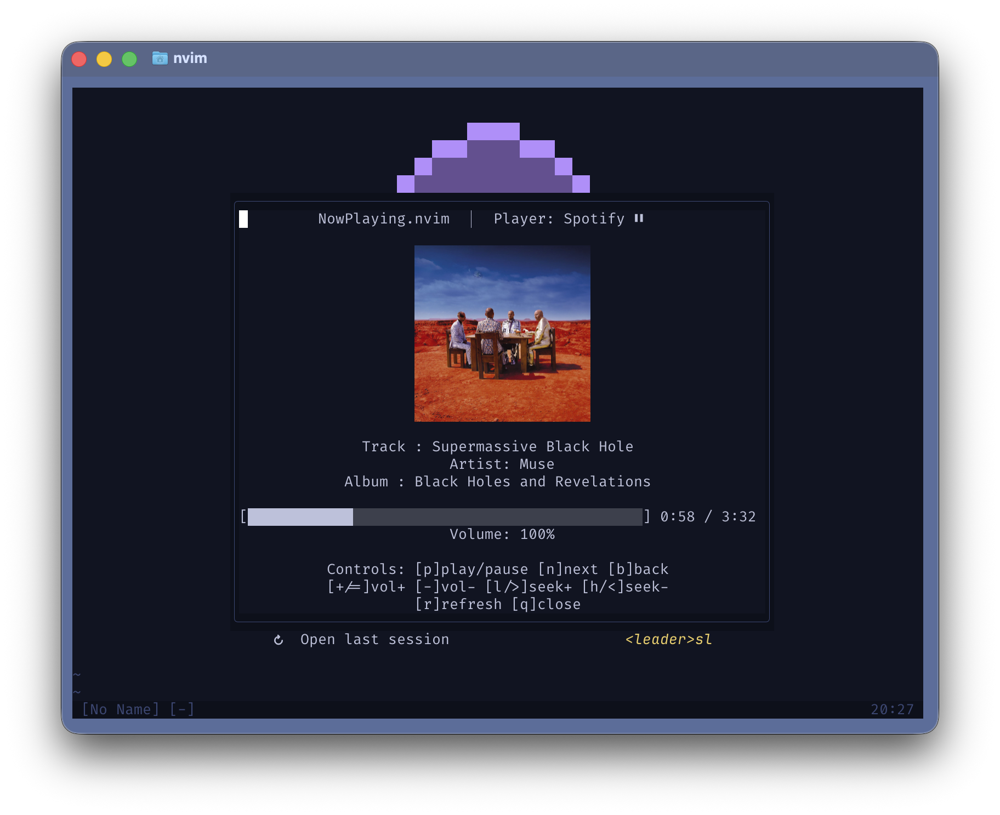
  <p>Panel showing paused state.</p>
</details>

<details>
  <summary>Notification</summary>
  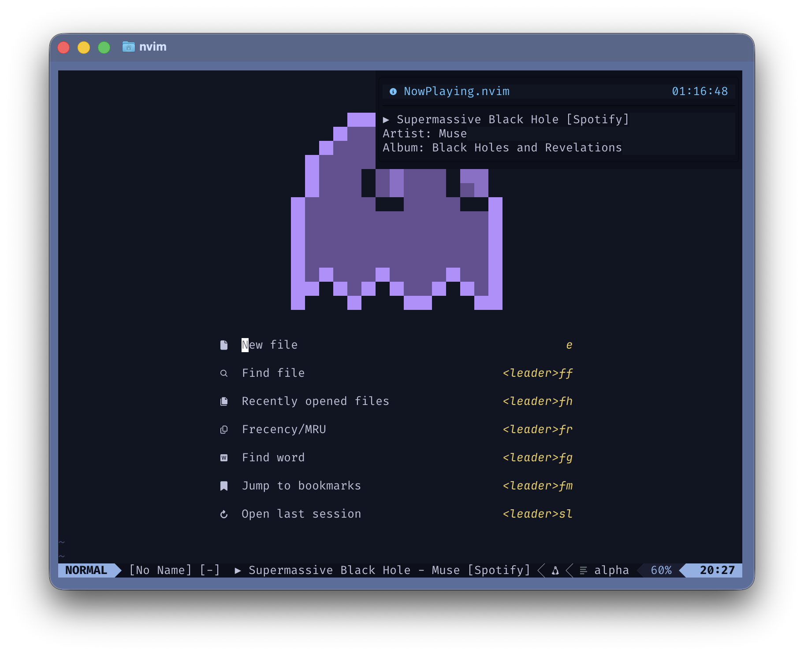
  <p>Track-change toast via <code>vim.notify</code>.</p>
</details>

<details>
  <summary>Statusline (playing)</summary>
  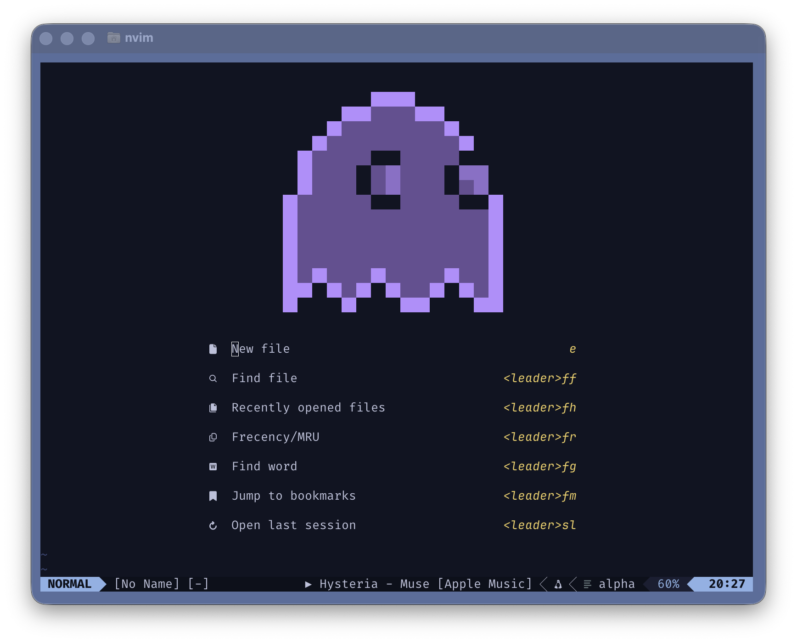
  <p>Statusline snippet showing playing icon/text.</p>
</details>

<details>
  <summary>Statusline (paused)</summary>
  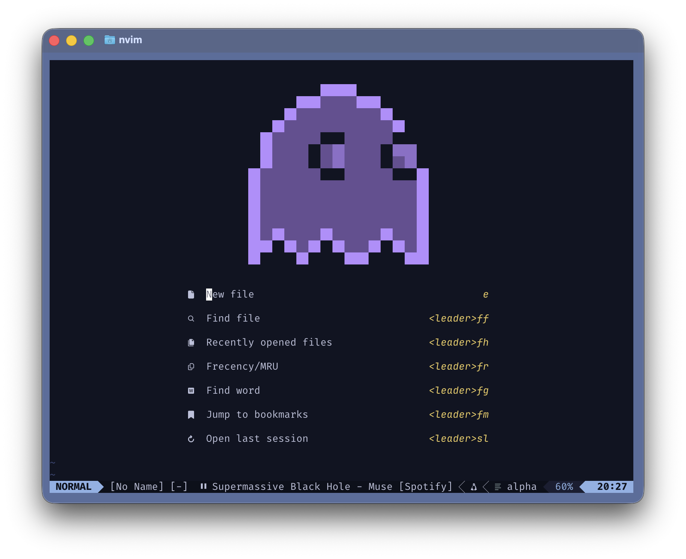
  <p>Statusline snippet showing paused icon/text.</p>
</details>

## Requirements 📦

- macOS with Apple Music or Spotify installed.
- `osascript` available (default on macOS).
- [telescope.nvim](https://github.com/nvim-telescope/telescope.nvim) (optional; required for Spotify search).
- `curl` for Spotify API calls and downloading artwork to cache.
- [ImageMagick](https://imagemagick.org/) (optional; required for artwork rendering and adaptive accent colors).
- [image.nvim](https://github.com/3rd/image.nvim) (optional; required for artwork rendering in the panel).

## Installation 🧰

### Lazy.nvim

Minimal (no artwork, no Telescope search):

```lua
{
  "mattpetters/nowplaying.nvim",
  config = function()
    require("player").setup()
  end,
}
```

Full setup with artwork and Telescope search:

```lua
{
  "mattpetters/nowplaying.nvim",
  dependencies = {
    "nvim-telescope/telescope.nvim",
    {
      "3rd/image.nvim",
      opts = { backend = "kitty" }, -- or "ueberzug" / "sixel" — check your terminal compatibility
    },
  },
  config = function()
    require("player").setup({
      panel = {
        elements = {
          artwork = { enabled = true, download = true },
        },
      },
    })
  end,
}
```

### Packer.nvim

```lua
use({
  "mattpetters/nowplaying.nvim",
  requires = {
    "nvim-telescope/telescope.nvim",
    {
      "3rd/image.nvim",
      config = function()
        require("image").setup({ backend = "kitty" })
      end,
    },
  },
  config = function()
    require("player").setup()
  end,
})
```

## Spotify Authentication 🔐

This fork adds full Spotify Web API support via PKCE OAuth. To use Spotify search, playback control, and queue features:

1. Run `:NowPlayingSpotifyAuth` — this opens a browser for Spotify login.
2. Authorize the app and copy the redirect URL back when prompted.
3. Tokens are persisted locally and refreshed automatically.

To log out: `:NowPlayingSpotifyLogout`

> You can optionally provide your own Spotify `client_id` in the config under `spotify.client_id`.

## Commands ⌨️

| Command | Description |
|---------|-------------|
| `:NowPlayingPlayPause` | Toggle playback |
| `:NowPlayingNext` / `:NowPlayingPrev` | Next / previous track |
| `:NowPlayingStop` | Stop playback |
| `:NowPlayingVolUp` / `:NowPlayingVolDown` | Volume ±5% |
| `:NowPlayingSeekForward` / `:NowPlayingSeekBackward` | Seek ±5s |
| `:NowPlayingTogglePanel` | Open/close the floating panel |
| `:NowPlayingNotify` | Show current track via `vim.notify` |
| `:NowPlayingRefresh` | Refresh player state and redraw UI |
| `:NowPlayingSearch` | Open Telescope Spotify search picker |
| `:NowPlayingSpotifyAuth` | Authenticate with Spotify (PKCE OAuth) |
| `:NowPlayingSpotifyLogout` | Clear Spotify tokens |

**Panel keymaps** (when the panel is focused):

`p` play/pause · `n` next · `b` previous · `x` stop · `+`/`=` volume up · `-` volume down · `l`/`>` seek forward · `h`/`<` seek backward · `r` refresh · `q` close

**Telescope picker keymaps**:

`<CR>` play (or play entire playlist) · `<C-q>` queue track · `<C-t>` browse/drill into album or playlist tracks

**Global keymaps** (default `<leader>np` prefix):

| Keymap | Action |
|--------|--------|
| `<leader>np` | Toggle panel |
| `<leader>npp` | Play/pause |
| `<leader>npn` | Next track |
| `<leader>npb` | Previous track |
| `<leader>npx` | Stop |
| `<leader>np+` / `<leader>np-` | Volume up/down |
| `<leader>npl` / `<leader>nph` | Seek forward/backward |
| `<leader>npr` | Refresh |
| `<leader>npi` | Notify |
| `<leader>nps` | Spotify search |

## Configuration 🛠️

```lua
require("player").setup({
  player_priority = { "apple_music", "spotify", "macos_media" }, -- provider order
  auto_switch = true, -- fall back to next provider when current is inactive
  poll = {
    enabled = true,
    interval_ms = 5000,
  },
  notify = {
    enabled = false,
    timeout = 2500,
    elements = {
      track_title = true,
      artist = true,
      album = true,
      status_icon = true,
      player = true,
    },
  },
  statusline = {
    elements = {
      track_title = true,
      artist = true,
      album = true,
      status_icon = true, -- ▶/⏸
      player = true,
    },
    separator = " - ",
    max_length = 50,
    marquee = {
      enabled = true,   -- scroll overflow text instead of truncating
      step_ms = 140,    -- animation tick rate
      pause_ms = 1400,  -- pause at each end before scrolling
      gap = "   ",      -- spacing between looped text copies
    },
  },
  keymaps = {
    enabled = true,
    prefix = "<leader>np",
    maps = {
      toggle_panel = "",  -- <leader>np
      play_pause = "p",
      next_track = "n",
      previous_track = "b",
      stop = "x",
      volume_up = "+",
      volume_down = "-",
      seek_forward = "l",
      seek_backward = "h",
      refresh = "r",
      notify = "i",
      search = "s",       -- <leader>nps — Spotify search
    },
  },
  panel = {
    enabled = true,
    border = { "▛", "▀", "▜", "▐", "▟", "▄", "▙", "▌" }, -- block-character border
    draggable = true,       -- left-click and drag to move
    resizable = true,       -- grab edges/corners to resize
    adaptive_colors = true, -- extract accent color from album artwork
    min_width = 30,         -- minimum panel width when resizing
    min_height = 8,         -- minimum panel height when resizing
    width = nil,            -- fixed width (nil = auto)
    height = nil,           -- fixed height (nil = auto)
    elements = {
      track_title = true,
      artist = true,
      album = true,
      progress_bar = true,
      volume = true,
      controls = true,
      artwork = {
        enabled = true,
        cache_dir = vim.fn.stdpath("cache") .. "/nowplaying.nvim",
        download = true,  -- download remote Spotify artwork to cache
        width = 20,
        height = 10,
      },
    },
  },
  spotify = {
    client_id = nil,  -- uses built-in default; override to use your own Spotify app
    search = {
      debounce_ms = 300,
      limit = 7,      -- results per type (track/album/artist)
      market = nil,   -- ISO 3166-1 alpha-2 country code, e.g. "US"
    },
    actions = {
      default = "play",     -- "play" or "queue"
      secondary = "queue",  -- bound to <C-q> in Telescope picker
    },
  },
  log_level = "warn",
})
```

### Responsive Panel Breakpoints

The panel automatically adjusts its layout based on size:

| Breakpoint | Min Size | Visible Elements |
|------------|----------|-----------------|
| **Large** | ≥55w × ≥14h | Artwork, title, artist, album, progress bar, controls with key hints |
| **Medium** | ≥40w × ≥10h | Smaller artwork, title, artist, album, progress bar, control icons (no key hints) |
| **Small** | ≥30w × ≥8h | Title, artist, progress bar only |
| **Tiny** | <30w | Title and artist only |

## Statusline / Winbar 📏

```lua
-- LuaLine/Heirline/etc.
local nowplaying = require("player").statusline
```

### Lualine

```lua
local nowplaying = require("player").statusline

require("lualine").setup({
  sections = {
    lualine_c = { nowplaying },
  },
})
```

### Heirline

```lua
local statusline = require("player").statusline

require("heirline").setup({
  statusline = {
    statusline,
    -- add other components here
  },
})
```

## Artwork 🖼️

Album artwork is rendered as real images in the panel using **image.nvim**. Spotify artwork is downloaded and cached when `panel.elements.artwork.download = true`; Apple Music artwork is extracted to `cache_dir`.

When `adaptive_colors` is enabled, the dominant color from the album artwork is extracted via ImageMagick and used to tint the panel border and background — giving each album its own visual identity.

## Planned Work 🔜

- Linux support (MPRIS backend)
- Windows support (media session/PowerShell backend)
- Interactive seek bar (click to seek)
- Volume indicator bar
- Smooth artwork transitions on track change

## Credits 🙌

This plugin is a fork of [**Ferouk/nowplaying.nvim**](https://github.com/Ferouk/nowplaying.nvim) by [@Ferouk](https://github.com/Ferouk) — the original author of the core AppleScript-based media integration, floating panel, and notification system.

Artwork rendering powered by [image.nvim](https://github.com/3rd/image.nvim) by @3rd.

## License 📄

GPL-3.0-only. (See LICENSE)
